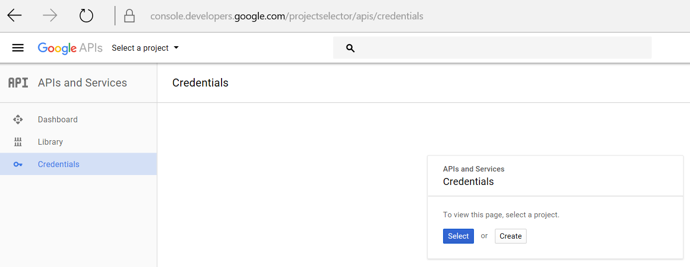
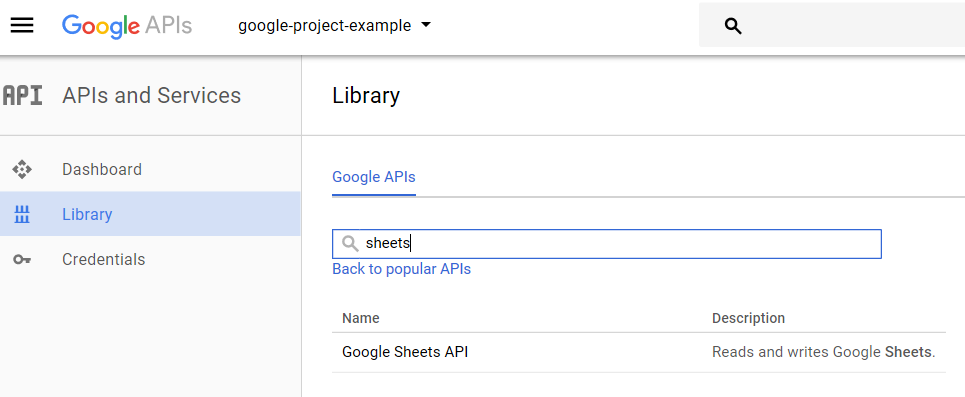

# google-api-support

Some functions to make Google APIs more usable.

## Install

`pip install google-api-support`

## Contribute

The contributions are encouraged so the library can keep growing and help more people.

You can also create an issue in order to point other contributors to desired functionalities.

  

## Functions avaliable

* Sheets
  * Get pandas.dataframe from Sheets
  * Upload pandas.dataframe to Sheets
  * Retrieve sheet names
  * Add sheets to a spreadsheet
  * Create new spreadsheet
* Slides
  * Create presentation
  * Get presentation info
  * Get presentation slides
  * Get slide notes
  * Replace text
  * Replace shape with image
  * Replace image
  * Get slide notes
  * Batch replace text
  * Batch replace shapes with images
  * Insert image
  * Duplicate object
  * Delete object
  * Batch delete object
  * Delete text
  * Batch delete text
  * Delete presentation notes
  * Transform object
* Drive
  * Get file name
  * Move file
  * Delete file
  * Copy file
  * Upload image
  * Create folder
  * List folders in folder
  * Get folder id by name
  * Get folder id by path
  * Download file

* Storage
  * Upload a file to google storage and get its URL

## Steps to use google Sheets API

In order to use Google APIs you will need to authenticate, this steps guide you through the process:

0. Create a project in console.developers.google.com

<https://console.developers.google.com>

0. Create google service account.
    0. Go to <https://console.developers.google.com/projectselector/apis/credentials> and create a new project.
    

    0. Create credentials.
    
        * In this first version, i will explain how to deal with Services accounts, so select "Service account key".

    0. Create a service account.
    
        * Download the .json file and KEEP IT SAFE.

    0. Now you have your service account created inside your new project.
    

    0. Copy your "user id" in "Manage service accounts" to use it later.
        * It looks like this one: `first-service-account@example-id-175820.iam.gserviceaccount.com`

    0. Go to your dashboard screen and go to "ENABLE APIS AND SERVICES" to "unlock" the desired API calls.
    In our example, we will just enable "Google sheets API".
    
    

## Check the specific credentials documentation file

[Credentials documentation](/docs/setup_credentials.md)

## Manually install dependencies

`pip install httplib2 oauth2client pandas google-api-python-client google.auth.transport.requests google.oauth2.credentials google_auth_oauthlib.flow`

## Complete first use example

### Example using virtualenv in bash terminal

`virtualenv venv`
`pip install google-api-support`
`pip install jupyterlab`
`source venv/Scripts/activate`
`export GOOGLE_APPLICATION_CREDENTIALS=C:/path/to/my/service_account_credentials.json`
`jupyter lab`
