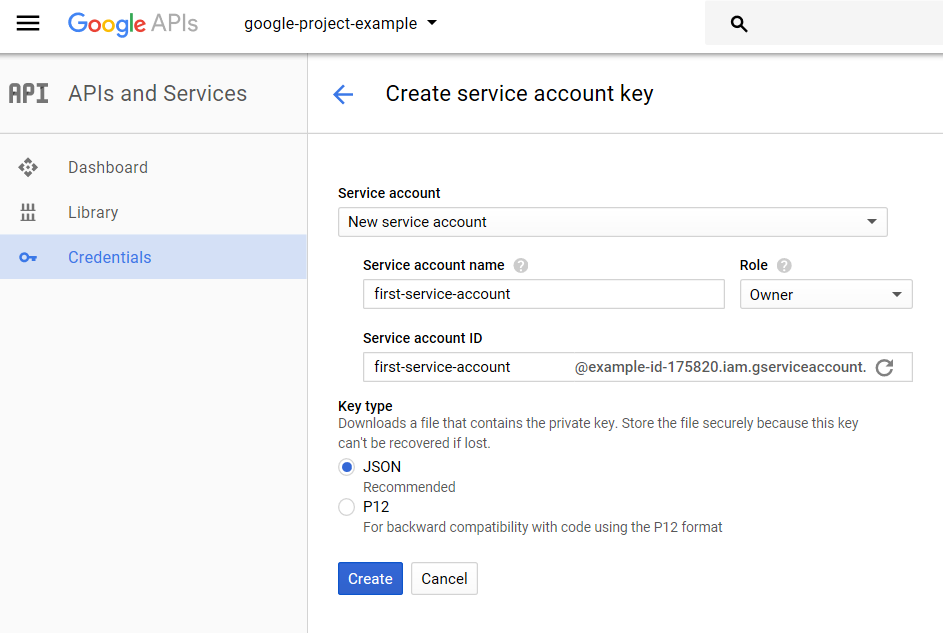
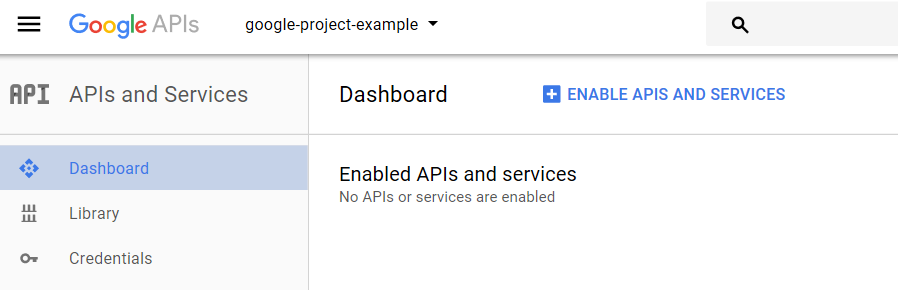

# google-api-support

Some functions to make Google APIs more usable. 

## Functions avaliable

* Sheets
    * Get pandas.dataframe from Sheets
    * Upload pandas.dataframe to Sheets
    * Retrieve sheet names
* Slides
    * Create presentation
    * Get presentation info
    * Get presentation slides
    * Get slide notes
    * Replace text
    * Replace shape with image
    * Replace image
    * Get slide notes
    * Batch replace text
    * Batch replace shapes with images
    * Insert image
    * Duplicate object
    * Delete object
    * Batch delete object
    * Delete text
    * Batch delete text
    * Delete presentation notes
    * Transform object
* Drive
    * Get file name
    * Move file
    * Delete file
    * Copy file
    * Upload image
    * Create folder
    * List folders in folder
    * Get folder id by name
    * Get folder id by path
    * Download file

## Install

'''pip install google-api-support'''

You might need to install manually:

'''pip install google-api-python-client httplib2 oauth2client pandas'''

## Steps to use google Sheets API

In order to use Google APIs you will need to authenticate, this steps guide you through the process:

0. Create a project in console.developers.google.com

https://console.developers.google.com

0. Create google service account.
    0. Go to https://console.developers.google.com/projectselector/apis/credentials and create a new project.
    
    
    0. Create credentials.
    
        * In this first version, i will explain how to deal with Services accounts, so select "Service account key".
    
    0. Create a service account.
    
        * Download the .json file and KEEP IT SAFE.
    
    0. Now you have your service account created inside your new project.
    
    
    0. Copy your "user id" in "Manage service accounts" to use it later.
        * It looks like this one: "first-service-account@example-id-175820.iam.gserviceaccount.com"
    
    0. Go to your dashboard screen and go to "ENABLE APIS AND SERVICES" to "unlock" the desired API calls.
    In our example, we will just enable "Google sheets API".
    
    

## Save credentials file inside the project:

Create a folder named `.Credentials` and store newly downloaded credentials renaming them with `service_credentials.json`

