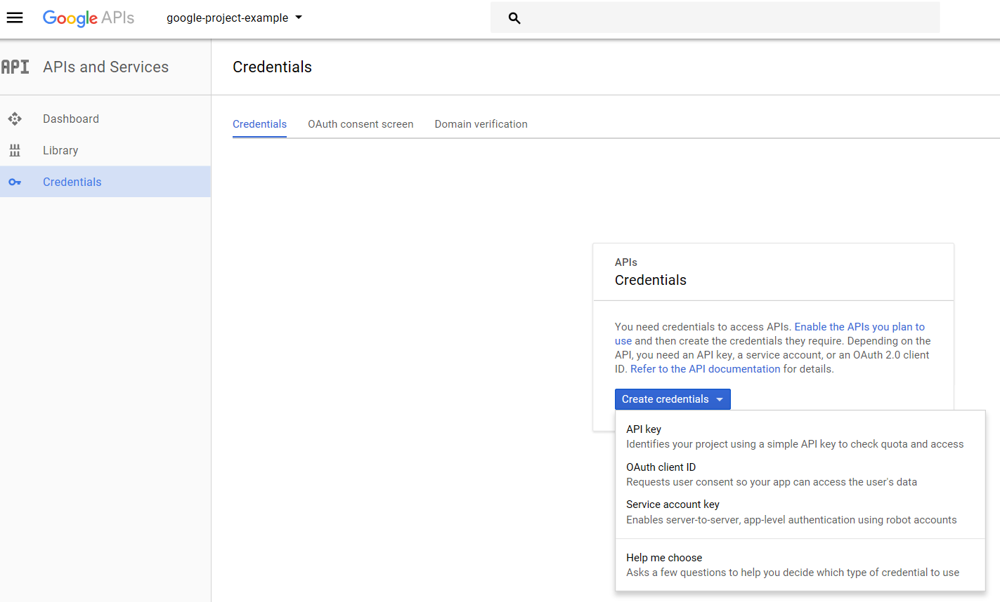
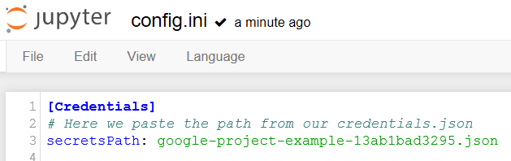

# google-api-python-tools

Some functions to make Google APIs more accesible using Pandas. 

## What will you achieve with this bunch of functions?

* How to create a pandas.dataframe from a Google Sheets.
* How to upload a pandas.dataframe to Google Sheets.
* How to retrieve sheet names from a Google Sheet.

## First steps

0. Install requirements
    '''pip install -r requirements.txt'''

0. Or install manually:
    '''
    pip install google-api-python-client
    pip install httplib2
    pip install oauth2client
    pip install jupyter notebook
    '''
    

## Steps to use google Sheets API

0. Create google service account.
    0. Go to https://console.developers.google.com/projectselector/apis/credentials and create a new project.
    
    
    0. Create credentials.
    
        * In this first version, i will explain how to deal with Services accounts, so select "Service account key".
    
    0. Create a service account.
    
        * Download the .json file and KEEP IT SAFE.
    
    0. Now you have your service account created inside your new project.
    
    
    0. Copy your "user id" in "Manage service accounts" to use it later.
        * It looks like this one: "first-service-account@example-id-175820.iam.gserviceaccount.com"
        
    0. Change in the file config.ini the path of the credentials .json.
    
    
    0. Go to your dashboard screen and go to "ENABLE APIS AND SERVICES" to "unlock" the desired API calls.
    In our example, we will just enable "Google sheets API".
    
    

## Motivation
I've been working with some Google APIs and I would like to share what I've learned.

[READ _RAW_ DATA] - [WORK WITH DATA] - [CREATE VALUABLE DATA] - [DISPLAY DATA]

I wanted to use Google APIs to develop a dashboard to analize and display data from Google Analytics, Google SearchConsole and Google Drive.

After retrieve the data, we can modify, filter, compare, delete and work with it.

### APIs used
* Sheets

### Auth

By now I explain only how to connect via Google services accounts. 